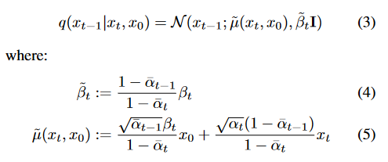

```python
# ldm/models/diffusion/ddpm.py#L147-157

# calculations for posterior q(x_{t-1} | x_t, x_0)
posterior_variance = (1 - self.v_posterior) * betas * (1. - alphas_cumprod_prev) / (
            1. - alphas_cumprod) + self.v_posterior * betas
# above: equal to 1. / (1. / (1. - alpha_cumprod_tm1) + alpha_t / beta_t)
self.register_buffer('posterior_variance', to_torch(posterior_variance))
# below: log calculation clipped because the posterior variance is 0 at the beginning of the diffusion chain
self.register_buffer('posterior_log_variance_clipped', to_torch(np.log(np.maximum(posterior_variance, 1e-20))))
self.register_buffer('posterior_mean_coef1', to_torch(
    betas * np.sqrt(alphas_cumprod_prev) / (1. - alphas_cumprod)))
self.register_buffer('posterior_mean_coef2', to_torch(
    (1. - alphas_cumprod_prev) * np.sqrt(alphas) / (1. - alphas_cumprod)))
```




`posterior_variance`是公式4和 $\sigma = (1-v) * \tilde{\beta} + v * \beta$ 的融合。

`posterior_mean_coef1` 是公式5的前，`posterior_mean_coef2` 是公式5的后